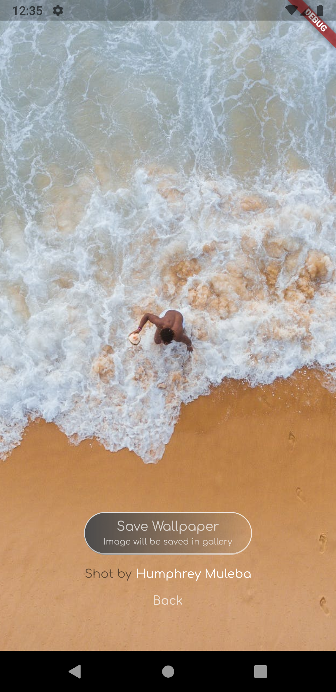

# wallpaperstore

This is an app which displays beautiful wallpapers fetched using the Pexels API with beautiful smooth animations.
You can browse by category or search anything you want :)

### This project uses Flutter SDK.

## Screenshots

  
   
  

## Get Sarted

1) Clone the repository.
2) Get the API key [here](https://www.pexels.com/api/) by signing in.
3) Provide the api key in lib/data/data.dart
4) Run "flutter pub get"
5) Run "flutter run"

## Information

The images are fecthed using the [Pexels API](https://www.pexels.com/api/).

## More

A few resources to get you started if this is your first Flutter project:

- [Lab: Write your first Flutter app](https://flutter.dev/docs/get-started/codelab)
- [Cookbook: Useful Flutter samples](https://flutter.dev/docs/cookbook)

For help getting started with Flutter, view our
[online documentation](https://flutter.dev/docs), which offers tutorials,
samples, guidance on mobile development, and a full API reference.
